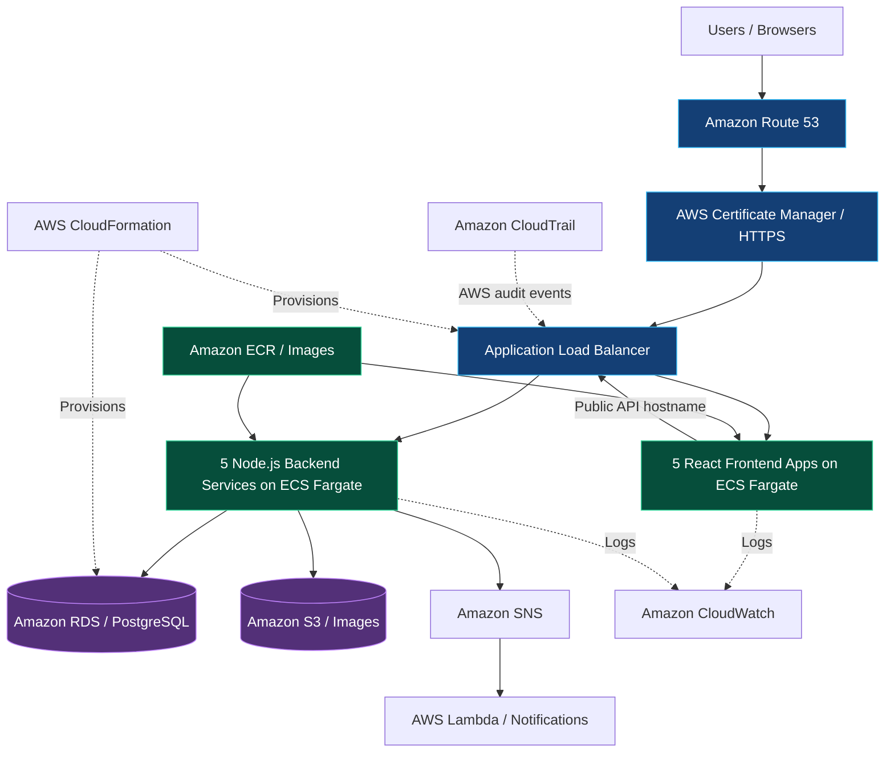
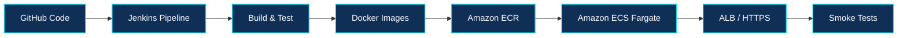

<div align="center">


<a href="https://git.io/typing-svg"></a>

<br />


**A role-based food ordering, restaurant management and delivery-tracking system with an AWS deployment blueprint.**

[Overview](#-project-overview) · [Architecture](#-architecture) · [Applications](#-applications--services) · [Quick Start](#-quick-start) · [CI/CD](#-cicd--aws-deployment) · [Testing](#-end-to-end-test-flow)

</div>

---

## ✨ Project Overview

This project combines **five independent frontend applications** and **five Node.js/Express backend microservices**. It demonstrates local Docker Compose development and a corrected AWS deployment design using **Amazon ECS Fargate** for all ten application containers.

> [!IMPORTANT]
> **Recommended AWS instructions:** Follow [`AWS-DEPLOYMENT-GUIDE-FIXED.md`](AWS-DEPLOYMENT-GUIDE-FIXED.md) and review [`FIX-REPORT.md`](FIX-REPORT.md) where available in your repository. Older sections of the original README described an EKS-based default; **EKS is optional**, not the corrected default deployment.

> [!NOTE]
> This README describes the project's components and intended deployment workflow. It does **not** claim that the AWS production stack, DNS, HTTPS endpoint or CI/CD pipeline is currently live or verified.

### 🌟 Feature highlights

- 🔐 **Role-based authentication** — separate customer, restaurant, delivery and admin journeys; JWT and bcrypt in the auth layer.
- 🍔 **Food catalog** — restaurant and menu management, item images, prices and availability.
- 🛒 **Customer ordering** — cart, checkout, profile, saved addresses and order history.
- 🧑‍🍳 **Restaurant operations** — incoming orders and status progression.
- 🛵 **Delivery tracking** — delivery assignment and Socket.IO location updates.
- 🧰 **Admin management** — restaurant and food CRUD, image upload and platform order visibility.
- 💳 **Safe payment simulation** — success, failure, retries and refund scenarios; **no real charges**.
- ☁️ **AWS deployment design** — ALB, Route 53, ACM, ECS, ECR, RDS, S3, Secrets Manager, SNS/Lambda, CloudWatch and CloudTrail.

---

## 🏗️ Architecture



**Deployment topology:** `auth.*`, `customer.*`, `restaurant.*`, `delivery.*`, `admin.*` and `api.*` are routed through HTTPS host/path rules. Browser applications should use the **public API base URL**, not internal container hostnames. Domain setup and certificate validation must be completed before treating endpoints as live.

## 🧩 Applications & Services

### Frontend applications

| Application | Local URL | Purpose |
|:--|:--|:--|
| 🔐 Auth App | http://localhost:9000 | Login, registration, role-based redirects |
| 🛒 Customer App | http://localhost:9001 | Browse, order, checkout and track |
| 🍽️ Restaurant App | http://localhost:9002 | Menu and order management |
| 🛵 Delivery App | http://localhost:9003 | Accept and update deliveries |
| 🛡️ Admin Panel | http://localhost:9004 | Restaurant, food and order administration |

### Backend microservices

| Service | Local Port | Responsibility |
|:--|:--:|:--|
| 📦 Order Service | `4000` | Order creation and status changes |
| 💳 Payment Service | `4001` | **Simulated** payment processing |
| 📍 Tracking Service | `4002` | Socket.IO location updates |
| 🔑 Auth Service | `4003` | Authentication, roles and profiles |
| 🍜 Catalog Service | `4004` | Restaurants, menu items and images |

**Database:** PostgreSQL on port `5432` in the local environment.

---

## 🛠️ Technology Stack

<div align="center">

| Layer | Technologies |
|:--|:--|
| **Frontend** | React, Vite |
| **Backend** | Node.js, Express, Socket.IO, JWT, bcrypt |
| **Data & assets** | PostgreSQL / Amazon RDS, Amazon S3 |
| **Containers** | Docker, Docker Compose, Amazon ECR |
| **Cloud runtime** | Amazon ECS Fargate, Application Load Balancer |
| **CI/CD & IaC** | Jenkins, AWS CloudFormation, Ansible |
| **Networking & security** | Route 53, ACM, IAM, Secrets Manager |
| **Events & observability** | SNS, Lambda, CloudWatch, CloudTrail |
| **Optional learning path** | Kubernetes / Amazon EKS manifests |

</div>

## 🔄 CI/CD & AWS Deployment



The repository documents a Jenkins-based workflow for building application images, pushing them to ECR and deploying ECS services. **Validate the actual Jenkinsfile and target AWS resources before running a deployment.** Infrastructure templates live under `infrastructure/cloudformation/`.

<details>
<summary><b>📁 Explore the project structure</b></summary>

```text
food-delivery-platform/
├── apps/
│   ├── auth-app/
│   ├── customer-app/
│   ├── restaurant-app/
│   ├── delivery-app/
│   └── admin-panel/
├── services/
│   ├── auth-service/
│   ├── catalog-service/
│   ├── order-service/
│   ├── payment-service/
│   └── tracking-service/
├── lambda/
│   └── order-notifier/
├── infrastructure/
│   ├── cloudformation/
│   ├── jenkins/
│   ├── ansible/
│   └── k8s/                # Optional EKS path
├── docker-compose.yml
└── README.md
```

</details>

---

## 🚀 Quick Start

**Prerequisites:** Docker Engine / Docker Desktop and Docker Compose, with sufficient resources to run the local stack.

```bash
# From the repository root
docker compose build
docker compose up -d
docker compose ps
```

Open **http://localhost:9000** to begin with the authentication app. Use `docker compose logs -f` to troubleshoot startup issues.

> [!CAUTION]
> `docker compose down -v` **deletes named-volume data**, including local database data. Do not use it unless you intentionally want to reset your demo environment.

### Local admin provisioning

Admin self-registration is disabled. The original documentation includes both a scripted provisioning approach and an older example with different credentials; **do not rely on hard-coded sample passwords**. Check the active Compose configuration and auth-service provisioning script. Where the script is available, a PowerShell example is:

```powershell
$env:ADMIN_EMAIL = "admin@fooddelivery.local"
$env:ADMIN_PASSWORD = "<choose-a-strong-local-test-password>"
docker compose exec -e ADMIN_EMAIL=$env:ADMIN_EMAIL -e ADMIN_PASSWORD=$env:ADMIN_PASSWORD auth-service node src/scripts/provision-local-admin.js
```

Do not commit credentials, `.env` files, AWS keys or real customer information.

## 🧪 End-to-End Test Flow

1. **Register** customer, restaurant and delivery accounts from the auth app.
2. **Customer:** browse the catalog and place an order.
3. **Restaurant:** progress the order through `PLACED → ACCEPTED → PREPARING → OUT_FOR_DELIVERY`.
4. **Delivery:** accept the delivery, start location sharing and mark it delivered.
5. **Customer:** verify order status and live location updates via Socket.IO.
6. **Admin:** inspect orders and manage restaurants and food items.

The local demo restaurant UUID documented in the original project is `11111111-1111-1111-1111-111111111111`.

<details>
<summary><b>💳 View safe test payment scenarios</b></summary>

The payment service is a **simulation only**. It checks order amounts and can transition `REQUIRES_CONFIRMATION → PROCESSING → SUCCEEDED / FAILED`, generate `TEST-TXN-...` references, and simulate retry/refund scenarios. Only masked last-four card digits are retained according to the project documentation.

| Test card | Simulated result |
|:--|:--|
| `4242 4242 4242 4242` | Success |
| `4000 0000 0000 0002` | Declined |
| `4000 0000 0000 9995` | Insufficient funds |
| `4000 0000 0000 9987` | Processing error |

**TEST MODE — NO REAL PAYMENT.** Use these numbers only with the local mock payment service.

</details>

<details>
<summary><b>🧭 Deployment notes and current limitations</b></summary>

- **Default compute:** ECS Fargate for **five frontends and five backends**; EKS files are optional and may represent an earlier deployment design.
- **Real-time tracking:** location state is stored in memory in the documented version. One tracking task avoids state divergence; Redis or another shared store would be needed before horizontally scaling it.
- **Notifications:** the source documentation notes a placeholder Lambda in one deployment template; verify that the real `lambda/order-notifier/` code is packaged and deployed.
- **Images:** local catalog and auth uploads use Docker volumes; AWS S3 integration must be validated in the deployed environment.
- **Domain & HTTPS:** configure Route 53, ACM DNS validation and ALB routing. Do not treat example hostnames as working links.
- **Production readiness:** confirm IAM least privilege, secret handling, database access, health checks, logs, smoke tests and rollback before production use.

</details>

---

## 📚 Documentation

| Document | Why read it |
|:--|:--|
| [`AWS-DEPLOYMENT-GUIDE-FIXED.md`](AWS-DEPLOYMENT-GUIDE-FIXED.md) | Corrected AWS deployment walkthrough |
| [`AWS-DEPLOYMENT-GUIDE.md`](AWS-DEPLOYMENT-GUIDE.md) | Additional deployment background; compare against corrected guide |
| [`FIX-REPORT.md`](FIX-REPORT.md) | Documented deployment and application fixes |
| [`infrastructure/jenkins/Jenkinsfile`](infrastructure/jenkins/Jenkinsfile) | Jenkins pipeline definition |
| [`infrastructure/cloudformation/`](infrastructure/cloudformation/) | Infrastructure as Code templates |

*Some documentation links require the corresponding files to exist in your GitHub repository.*

---

<div align="center">

### 🌐 From Code to Cloud

**Plan → Build → Test → Containerize → Automate → Deploy → Observe**

<a href="https://www.linkedin.com/in/keerthivasan-d-awsdevops/"></a>


<sub>Built as a hands-on AWS & DevOps learning and portfolio project.</sub>

</div>
